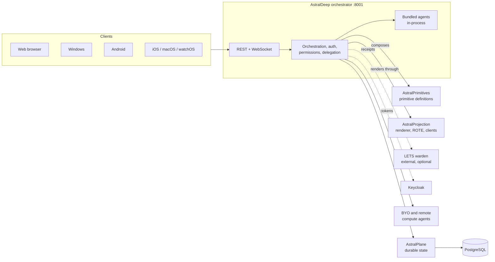

# AstralDeep

[](https://github.com/AstralDeep/AstralDeep/actions/workflows/ci.yml)

AstralDeep is a clinical-AI, multi-agent platform. A single FastAPI orchestrator with a
PostgreSQL backend coordinates first-party, user-authored, and remote agents. It serves the REST
API, the WebSocket/A2A agent transport, the web client, and static assets on one port (8001). The
same server-owned user interface is rendered for the web, Windows, Android, and Apple clients.

The design rule throughout is **"LLM proposes, code decides"**. Models may draft layouts,
plans, or artifacts, but deterministic code validates, authorizes, bounds, and renders them.

## Contents

- [Architecture](#architecture)
- [Components](#components)
- [Repository layout](#repository-layout)
- [Getting started](#getting-started)
- [Configuration](#configuration)
- [Development workflow](#development-workflow)
- [Testing and continuous integration](#testing-and-continuous-integration)
- [Clients and releases](#clients-and-releases)
- [Agents](#agents)
- [Security model](#security-model)
- [Spec-driven development and governance](#spec-driven-development-and-governance)
- [Documentation](#documentation)
- [License](#license)

## Architecture

The user interface is server-driven along one pipeline:

**AstralPrimitives defines → AstralProjection renders and adapts → AstralDeep orchestrates.**

There is no single-page application. AstralDeep composes responses from typed UI primitives.
AstralProjection renders them to sanitized HTML for the web, or to structured frames for the
native clients, and its ROTE layer adapts them to each device's declared capabilities. Durable
state flows through AstralPlane, and agent authority can be enforced by an external LETS warden.



Bundled first-party agents run in-process by default. External, draft, and user-authored agents
keep explicit trust boundaries: they authenticate their transport and are treated as untrusted
at the server boundary.

## Components

AstralDeep composes four independently released component repositories, pinned as Git
submodules under `components/`. Each pin records an exact commit plus its contract version and
compatibility digests in [`config/astral-composition.json`](config/astral-composition.json).
Each component has its own constitution at `.specify/memory/constitution.md` in its repository,
and that constitution governs work inside the component.

| Component | Role | Availability |
|---|---|---|
| [AstralPrimitives](https://github.com/AstralDeep/AstralPrimitives) | Defines the UI primitives and their JSON serialization (published to PyPI as `astralprims`). | Required, embedded |
| [AstralProjection](https://github.com/AstralDeep/AstralProjection) | Renders and sanitizes primitives, adapts them per device (ROTE), owns the UI protocol manifest and the web, Windows, Android, and Apple clients. | Required, embedded |
| [AstralPlane](https://github.com/AstralDeep/AstralPlane) | Durable-state library: PostgreSQL pool, guarded migration registry, repositories, blob stores, and recovery. | Required, embedded |
| [LETS](https://github.com/AstralDeep/LETS) | Lineage Escrow Transition Systems: an external warden that conserves and attenuates agent authority and issues verifiable receipts. | External, feature-gated |

A component change always lands in its own repository first. AstralDeep adopts it by moving the
submodule pin and the matching manifest entries together, and `scripts/verify_composition.py`
fails closed when an installed component does not match its pin. See
[docs/component-composition.md](docs/component-composition.md).

## Repository layout

| Path | Contents |
|---|---|
| `backend/orchestrator/` | The orchestrator: dispatch, authentication, permissions, delegation, agent lifecycle, workspace, streaming, scheduling, UI design, and chrome events. `orchestrator.py` is the central runtime hub. |
| `backend/orchestrator/projection_surfaces/` | Host-authorized adapters that feed AstralProjection's reusable chrome surfaces. |
| `backend/orchestrator/plane_composition.py` | The fail-closed binding to the AstralPlane runtime. |
| `backend/agents/` | Bundled first-party agents. |
| `backend/persistent_agents/` | Durable, lease-based assignment runtime for long-running work. |
| `backend/shared/` | Shared protocol structures (`protocol.py`), the approved outbound HTTP path (`external_http.py`), and other cross-cutting helpers. |
| `backend/llm_config/`, `backend/personalization/`, `backend/scheduler/`, `backend/voice_agent/`, `backend/audit/` | Per-user LLM configuration, memory and personalization, scheduled jobs, conversational voice, and the audit trail. |
| `backend/tests/` and `*/tests/` | Backend test suites. |
| `components/` | The four pinned component submodules. |
| `config/` | The composition manifest and related configuration. |
| `contracts/` | JSON Schemas for cross-repository contracts. |
| `deploy/` | Deployment assets (for example the LiveKit and LETS configurations). |
| `docs/` | Operator documentation (see [Documentation](#documentation)). |
| `scripts/` | Build, verification, release-evidence, and qualification tooling. |
| `sdk/` | The Astral agent SDK, built and tested outside the product image. |
| `specs/` | Numbered Spec Kit feature specifications, plans, and tasks. |
| `tooling/` | Locked CI tool manifests. |

## Getting started

### Prerequisites

- Git
- Docker with Docker Compose
- Python 3.11 or newer on the host, for the composition preflight and repository tooling (the product image itself runs Python 3.11)
- Node.js with Corepack, only if you run the web lint or browser suites locally

### Run the stack locally

```bash
git clone --recurse-submodules https://github.com/AstralDeep/AstralDeep.git
```

```bash
cd AstralDeep && cp .env.example .env
```

```bash
make up
```

`make up` verifies that every component submodule matches its pin, builds the images, and starts
PostgreSQL, LiveKit, and the application. The Makefile invokes `python`. If your host only
provides `python3`, run `make up PYTHON=python3`.

When the container reports healthy, open <http://localhost:8001>. Useful endpoints:

| Endpoint | Purpose |
|---|---|
| `/healthz` | Liveness |
| `/readyz` | Readiness (the compose health check) |
| `/docs` | Interactive API documentation |

The example environment runs in development mode (`ASTRAL_ENV=development`) with mock
authentication (`USE_MOCK_AUTH=true`), so no Keycloak realm is needed for local work. Mock
authentication is refused outside development.

### Connect a language model

The product ships with no LLM credential. Each user connects their own provider through the
first-run dialog (later under Settings → LLM settings). The key is stored per user and
encrypted under `CREDENTIAL_ENCRYPTION_KEY`. Administrators separately configure a System LLM
for background work such as scheduled jobs and knowledge synthesis. Provider keys are never
read from the environment.

## Configuration

All runtime configuration comes from environment variables, loaded from `.env` by Docker
Compose. [`.env.example`](.env.example) documents every setting, including the `FF_*`
feature flags that gate optional subsystems.

- **Production is the default.** An unset `ASTRAL_ENV` means production. Production refuses to
  start with missing or placeholder secrets or with mock authentication, exiting with the
  documented configuration-error code 78.
- **Secrets stay out of Git.** The Keycloak client secret, `CREDENTIAL_ENCRYPTION_KEY`, the
  agent API key, and similar values are supplied at deploy time only.
- **Image and environment are separate.** The published image bakes in no configuration. A
  changed `.env` takes effect only when the container is recreated (`make apply-config`), not on
  a restart.

For a full production setup (Keycloak, TLS, secrets, voice, backups), follow the
[production deployment guide](docs/production-deployment.md).

## Development workflow

Backend source is baked into the image. After editing code, re-sync the running container
rather than just restarting it:

```bash
make sync
```

Frequently used targets (`make help` lists them all):

| Target | Purpose |
|---|---|
| `make up` / `make down` | Build and start, or stop, the stack (volumes are kept). |
| `make sync` | Rebuild and recreate the app with the current backend and exact component wheels. |
| `make apply-config` | Recreate the app so a changed `.env` takes effect. |
| `make logs` / `make shell` / `make psql` | Follow app logs, open a shell in the app container, or open `psql`. |
| `make test-backend` | Run the default backend pytest selection inside the app container. |
| `make test` | Run the backend, AstralProjection, and web browser suites. |
| `make lint` | Run ruff and the tracked ESLint configuration, as CI does. |
| `make secret-scan` | Scan the full Git history with the pinned Gitleaks. |
| `make bootstrap` | Initialize the submodules and install the pinned component wheels into the host Python environment. |

Engineering rules that apply to every change (see [AGENTS.md](AGENTS.md) and the constitution):

- Backend code is Python compatible with the production Python 3.11 image (ruff targets `py311`).
- Source files carry a header of at most three sentences and otherwise document themselves; the only other comments allowed are rare one-line explanations of *why*.
- Tests cover golden paths, edge cases, denials, and failures, and changed Python lines keep at least 90% coverage.
- Web output is escaped and sanitized through AstralProjection's renderer helpers, and UI primitives are built with `.to_dict()` or `create_ui_response()`.
- Outbound requests to user-controlled URLs go through `backend/shared/external_http.py`.

## Testing and continuous integration

`backend/pytest.ini` discovers `backend/tests` and `backend/persistent_agents/tests`. Several
module suites live elsewhere, so for merge-level confidence mirror the explicit invocations in
[`.github/workflows/ci.yml`](.github/workflows/ci.yml). To run the default selection directly:

```bash
docker exec astraldeep bash -c "cd /app/backend && python -m pytest -q"
```

Every pull request and every push to `main` runs the required gates:

1. **Lint:** ruff for Python and ESLint for the maintained JavaScript.
2. **Tests:** the complete backend suite against an isolated PostgreSQL, run as whole-suite groups (`tests`, `persistent_agents`, `modules`), plus the AstralPlane and AstralProjection suites at their pinned revisions.
3. **Changed-code coverage:** at least 90% of changed executable lines. A change with no measurable lines is recorded as not applicable.
4. **Image build:** the production image builds from a clean checkout.
5. **Boot smoke:** the image answers its probes in development posture, and a production boot with missing secrets exits with the configuration-error code.
6. **Secret scan:** committed credential material fails the run.

Every CI job must finish within 30 minutes. Soak tests are not used, and required gates do not
depend on live third-party services or wall-clock timing. A green `main` publishes the
production image to the GitHub Container Registry with an immutable commit tag.

## Clients and releases

| Client | Technology | Source |
|---|---|---|
| Web | Server-rendered HTML with vanilla JavaScript and CSS, served by AstralDeep | AstralProjection `backend/webrender/` |
| Windows | Python and PySide6 | AstralProjection `windows-client/` |
| Android | Kotlin and Jetpack Compose | AstralProjection `android-client/` |
| iOS, macOS, watchOS | Swift and SwiftUI | AstralProjection `apple-clients/` |

Every client renders the same server-owned chrome, settings surfaces, and theme. A change to
the UI protocol, chrome, theme, or layout lands on every in-scope client in the same feature,
guarded by the protocol manifest and each client's drift tests. The native clients sign in to
Keycloak with PKCE (or, on watchOS, the device-authorization grant).

Client releases run from protected workflows in this repository over the pinned AstralProjection
revision. Windows releases are cut from `v*` tags, Apple releases from `apple-v*` tags, and
Android releases are started manually. Signing and publication run only in separately
protected jobs.

## Agents

Bundled first-party agents live in `backend/agents/`:

| Agent | Purpose |
|---|---|
| `general` | File-reading and system tools |
| `medical` | Synthetic patient-data generation and CSV analysis |
| `journal_review` | Journal fit evaluation from OpenAlex and Crossref data |
| `web_research` | Web search with egress-gated page fetches and cited answers |
| `summarizer` | Text and URL summarization |
| `weather` | Current, historical, and forecast weather from Open-Meteo |
| `ml_services` | CLASSify, Forecaster, and LLM Factory tool wrappers |
| `connectors` | Office, design, developer, and creative tools behind one MCP surface |
| `computer_use` | Drives the user's own desktop from any of their clients |
| `remote_compute` | Remote-compute verbs, combining the read-only `remote_observe` and the gated `remote_control` tiers |
| `fhir` | Read-only clinical dashboards and a live activity feed over an operator-configured HL7 FHIR R5 server |
| `dice_roller` | A sample agent used by the test suite |

Beyond the bundled set:

- **Your own agents and skills.** Users can create agents and skills in the product. See [docs/your-own-agents-and-skills.md](docs/your-own-agents-and-skills.md).
- **Bring-your-own client agents.** Personal agents run on the user's own machine, are never shared, and go offline when the client closes. See [docs/byo-client-agents.md](docs/byo-client-agents.md).
- **Remote compute.** Agents on remote machines, and remote computer control. See [docs/remote-compute-agents.md](docs/remote-compute-agents.md) and [docs/remote-computer-control.md](docs/remote-computer-control.md).
- **MCP server endpoint.** AstralDeep also exposes its tools over MCP. See [docs/mcp-server-endpoint.md](docs/mcp-server-endpoint.md).

## Security model

- **Identity:** Keycloak is the only user identity provider, with authorization enforced at the API layer.
- **Delegation:** agents act on RFC 8693 delegated tokens with attenuated scopes. Recursive delegation, off by default behind a feature flag, preserves monotonic attenuation, a complete actor chain, and a depth bound.
- **Runtime gates:** per-user tool permissions, a policy engine, PHI gates, confirmation gates, and egress validation apply to every agent, including in-process first-party agents.
- **Isolation:** data is owner-scoped end to end, and external or user-authored agents are untrusted at the server boundary.
- **Audit:** security-relevant actions, including delegated-authority use, append to a per-owner hash-chained audit trail.
- **LETS (optional):** an external warden can escrow a finite authority envelope, issue signed receipts, and require verification before protected effects. See [docs/lets-external-warden.md](docs/lets-external-warden.md).
- **Fail closed:** production refuses unsafe configuration instead of degrading silently.

## Spec-driven development and governance

AstralDeep uses [Spec Kit](https://github.com/github/spec-kit). Each feature has a numbered
directory under `specs/` holding its specification, plan, tasks, contracts, and
verification records.

- **Constitution:** [`.specify/memory/constitution.md`](.specify/memory/constitution.md) is the highest-authority engineering policy for this repository and for how AstralDeep consumes its components.
- **Agent guide:** [AGENTS.md](AGENTS.md) is the shared guide for coding agents (Claude, Codex, and others). It covers repository routing, rules, the feature-ownership preflight, and build and verification commands.
- **Feature flow:** specify → clarify → plan → tasks → analyze → implement, using the Spec Kit skills installed in `.agents/skills/` for Codex (and per machine in `.claude/skills/` for Claude).
- **Database schema changes:** these land only in AstralPlane's guarded migration registry. AstralDeep then moves its exact schema pin; it never runs ad-hoc SQL.

## Documentation

Looking for a contribution? Browse the [bounty board](https://astraldeep.github.io/bounties.html)
and read the [contribution and points guide](https://astraldeep.github.io/contribute.html) before
starting. It explains pull request requirements and how verified merges into `main` award
points to the PR author across all five core repositories. To report a new problem or suggest an
improvement, use the [issue template](https://github.com/AstralDeep/AstralDeep/issues/new?template=issue.md).

| Guide | Covers |
|---|---|
| [Production deployment](docs/production-deployment.md) | Deploying and operating AstralDeep in production |
| [Component composition](docs/component-composition.md) | Component pins, verification, and recovery |
| [Keycloak realm settings](docs/keycloak-realm-settings.md) | Realm configuration for AstralDeep |
| [Keycloak agent delegation](docs/keycloak_agent_delegation_setup.md) | Token exchange for agent delegation |
| [Keycloak: Android client](docs/keycloak-android-client-setup.md) | The `astral-mobile` client |
| [Keycloak: Windows client](docs/keycloak-windows-client-setup.md) | The `astral-desktop` client |
| [ORCID identity](docs/keycloak-orcid-identity.md) | Direct ORCID identity for restricted external agents |
| [Bring-your-own client agents](docs/byo-client-agents.md) | Operating personal agents |
| [Your own agents and skills](docs/your-own-agents-and-skills.md) | Authoring agents and skills |
| [Remote compute agents](docs/remote-compute-agents.md) | Operating remote-compute agents |
| [Remote computer control](docs/remote-computer-control.md) | Controlling a remote computer |
| [FHIR Clinical Data agent](docs/fhir-agent.md) | Connecting the FHIR agent to a FHIR R5 server |
| [MCP server endpoint](docs/mcp-server-endpoint.md) | AstralDeep's MCP endpoint |
| [External LETS warden](docs/lets-external-warden.md) | Running with LETS enforcement |
| [Migration rollback](docs/migration-rollback-074.md) | Rolling back the component-split migration |

## License

AstralDeep is released under the [Apache License 2.0](LICENSE.md).
